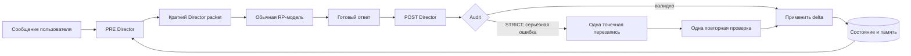

# Narrative Engine для SillyTavern


**Narrative Engine** — расширение для SillyTavern, которое добавляет к обычной ролевой модели отдельного **Режиссёра**. Ролевая модель по-прежнему пишет художественный ответ, а Режиссёр следит за непрерывностью сцены, состоянием персонажей, отношениями, знаниями, сюжетными линиями, событиями мира, долговременной памятью и спрайтами.

Проект не является форком SillyTavern и не подменяет его основной генератор. Он подключается через публичный API расширений и при необходимости использует отдельный серверный плагин для безопасного хранения ключа и SQLite.

> Текущая версия: **0.2.0**. Совместимость проверялась по коду SillyTavern `release` 1.19.0, commit `06bde939fb1e9c4c8d8641d810f0a916b5bce127`. Автоматические тесты пройдены; финальная проверка с конкретной моделью, карточками и спрайтами выполняется уже в установленном SillyTavern.

## Содержание

- [Что решает Narrative Engine](#что-решает-narrative-engine)
- [Как устроен один ход](#как-устроен-один-ход)
- [Профили и отдельные промпты состояний](#профили-и-отдельные-промпты-состояний)
- [Возможности](#возможности)
- [Установка расширения](#установка-расширения)
- [Выбор провайдера Режиссёра](#выбор-провайдера-режиссёра)
- [Установка серверного плагина](#установка-серверного-плагина)
- [Настройка](#настройка)
- [Состояние, память и восстановление](#состояние-память-и-восстановление)
- [Спрайты, группы и VN-режим](#спрайты-группы-и-vn-режим)
- [Slash-команды](#slash-команды)
- [Безопасность](#безопасность)
- [Диагностика и устранение проблем](#диагностика-и-устранение-проблем)
- [Разработка и тестирование](#разработка-и-тестирование)
- [Ограничения](#ограничения)

## Что решает Narrative Engine

В длинной ролевой игре модель постепенно начинает забывать, где находятся персонажи, что на них надето, кто чем владеет, какие секреты кому известны и какие обещания ещё не выполнены. Увеличение контекста помогает лишь частично: старый диалог становится дорогим, содержит шум и не гарантирует последовательность.

Narrative Engine разделяет две задачи:

| Компонент | Ответственность |
| --- | --- |
| **RP-модель SillyTavern** | Пишет реплики, действия и художественный текст |
| **Director-модель** | Готовит краткий пакет фактов перед ответом и разбирает результат после ответа |
| **Структурированное состояние** | Хранит сцену, персонажей, время, предметы, отношения, знания и сюжетные линии |
| **Эпизодическая память** | Возвращает только релевантные старые события, а не весь архив чата |
| **Аудитор** | Ищет противоречия, телепортацию знаний, нарушение канона и управление персонажем пользователя |
| **Sprite Director** | Выбирает только существующий файл спрайта из предварительно отфильтрованного списка |

Главный принцип: **Режиссёр не пишет историю вместо RP-модели**. Он передаёт ей ограничения и подсказки, а после генерации сохраняет только подтверждённые изменения.

## Как устроен один ход



Обычный ход содержит:

1. **Один PRE-вызов** Режиссёра перед RP-генерацией.
2. **Один обычный вызов** RP-модели SillyTavern.
3. **Один POST-вызов** после получения полного ответа.

Профили состояния собираются в единый системный промпт и **не увеличивают число вызовов**. POST запускается после полного ответа, а не на каждом токене стриминга. В режиме строгого аудита допускается максимум одна точечная перезапись и одна повторная проверка.

Каждый асинхронный запрос привязан к чату, сессии и генерации. При переключении чата незавершённая работа отменяется, а запоздавший ответ не может изменить состояние другого чата. Если Режиссёр недоступен, основной RP-запрос продолжается без устаревшего пакета.

## Профили и отдельные промпты состояний

Да — для каждого состояния используется отдельный промпт. В каталоге [`prompts/states`](prompts/states) находятся 24 независимых фрагмента: восемь систем × три уровня строгости.

### Готовые профили

| Профиль | Для чего подходит | Акцент |
| --- | --- | --- |
| **Balanced** | Большинство ролевых игр | Ровный контроль всех систем |
| **Strict continuity** | Детектив, survival, сложная физическая сцена | Физическая непрерывность, знания и точная память |
| **Living world** | Кампания с расписаниями, NPC и событиями вне кадра | Сюжетные долги и причинное развитие мира |
| **Character driven** | Отношения, драма, визуальная новелла | Характер, отношения, знания и эмоции |
| **Custom** | Точная ручная настройка | Свой уровень для каждой из восьми систем |

### Уровни строгости

| Уровень | Поведение |
| --- | --- |
| **Light** | Фиксирует только крупные и очевидные изменения, почти не вмешивается |
| **Balanced** | Отслеживает значимые детали, но не превращает декоративный текст в факты |
| **Strict** | Требует текстового основания, жёстко соблюдает причинность и границы знаний |

В режиме **Custom** отдельно настраиваются Continuity, Character state, Relationships, Knowledge / secrets, Plot manager, World simulation, Memory retrieval и Sprite director. Профиль выбирается в **Extensions → Narrative Engine → Director profile**. Ручная матрица появляется только для Custom. Отключённая Story system не включается в собранный промпт.

Тексты можно осознанно редактировать в [`prompts/states`](prompts/states): для каждой системы есть `light.md`, `balanced.md` и `strict.md`. Изменения подхватываются после перезагрузки расширения или кнопки **Clear transient cache**.

## Возможности

### Непрерывность и состояние

- сцена, локация, присутствующие персонажи и внутриигровое время;
- позы, одежда, травмы, удерживаемые предметы и физические объекты;
- отношения между любыми парами персонажей;
- индивидуальные границы знаний, ложные убеждения и секреты;
- сюжетные линии, статусы, зависимости, дедлайны и narrative debt;
- планы NPC и события мира вне кадра;
- атомарные immutable-delta с источником и уверенностью;
- checkpoints и детерминированная перестройка после edit/delete/swipe.

### Память

- свежий контекст чата;
- компактное состояние текущей сцены;
- Top-K поиск по эпизодической памяти;
- структурированный канон из Character Cards и World Info;
- периодическая консолидация только долговечных фактов;
- ограниченный бюджет контекста вместо полного старого диалога.

### Аудит

Режиссёр проверяет положение, одежду, предметы, двери, хронологию, телепортацию персонажей и знаний, противоречия канону, выдуманные действия пользователя, резкий слом характера, забытые сюжетные обязательства и стагнацию.

Режимы:

- `off` — проверка не влияет на принятие ответа;
- `soft` — ошибка сохраняется в диагностике, некорректная delta не применяется;
- `strict` — для серьёзной ошибки разрешена одна минимальная перезапись с повторной проверкой.

## Установка расширения

1. Откройте **Extensions → Install extension**.
2. Вставьте адрес:

   ```text
   https://github.com/Gam1409/Narrative-Engine
   ```

3. Подтвердите установку и перезагрузите SillyTavern.
4. Откройте **Extensions → Narrative Engine**.
5. Выберите провайдера, модель, профиль и нужные Story systems.
6. Нажмите **Test connection**.
7. После успешной проверки включите **Enabled**.

Репозиторий приватный: среда, из которой SillyTavern устанавливает расширение, должна иметь к нему доступ. При ручной установке скопируйте содержимое репозитория в каталог пользовательских расширений SillyTavern.

## Выбор провайдера Режиссёра

| Provider | Когда использовать | Особенности |
| --- | --- | --- |
| **Server plugin** | Рекомендуемый вариант для удалённого API и постоянной установки | Ключ хранится только в env сервера, состояние — в SQLite |
| **OpenAI-compatible** | Локальный endpoint без авторизации | Прямой запрос браузера; endpoint должен разрешать CORS |
| **Ollama** | Локальная Ollama | Работает через локальный HTTP API |
| **Current SillyTavern connection** | Быстрая проба без отдельного endpoint | Использует текущую конфигурацию ST и зависит от её возможностей |

В браузерной части намеренно **нет поля API key**: `extensionSettings` сохраняются открытым текстом. Для сервиса с секретным ключом используйте серверный плагин.

Рекомендуется отдельная модель, которая стабильно возвращает JSON и хорошо следует схеме. Температура Режиссёра по умолчанию низкая (`0.2`), потому что здесь важнее воспроизводимость.

## Установка серверного плагина

Серверный плагин необязателен, но даёт безопасный proxy к Director API и постоянное SQLite-хранилище.

1. Скопируйте каталог [`server-plugin`](server-plugin) в `SillyTavern/plugins/narrative-engine`.
2. Установите runtime-зависимости:

   ```powershell
   cd SillyTavern/plugins/narrative-engine
   npm install --omit=dev
   ```

3. В конфигурации SillyTavern включите плагин:

   ```yaml
   enableServerPlugins: true
   ```

4. Задайте переменные окружения и перезапустите SillyTavern:

   ```text
   NARRATIVE_ENGINE_DIRECTOR_URL=https://director.example/v1
   NARRATIVE_ENGINE_DIRECTOR_MODEL=qwen3-coder-heretic
   NARRATIVE_ENGINE_DIRECTOR_API_KEY=your-secret
   ```

### Переменные окружения

| Переменная | По умолчанию | Назначение |
| --- | --- | --- |
| `NARRATIVE_ENGINE_DIRECTOR_URL` | пусто | Базовый OpenAI-compatible endpoint |
| `NARRATIVE_ENGINE_DIRECTOR_MODEL` | пусто | Модель Режиссёра |
| `NARRATIVE_ENGINE_DIRECTOR_API_KEY` | пусто | Секретный ключ; не отправляется в браузер |
| `NARRATIVE_ENGINE_STORAGE_DIR` | `DATA_ROOT/_storage/narrative-engine` | Каталог SQLite |
| `NARRATIVE_ENGINE_TIMEOUT_MS` | `30000` | Timeout запроса, 1000–120000 мс |
| `NARRATIVE_ENGINE_RETRIES` | `2` | Число повторов, 0–5 |
| `NARRATIVE_ENGINE_BODY_LIMIT_BYTES` | `524288` | Лимит JSON-тела, 16 KiB–2 MiB |
| `NARRATIVE_ENGINE_RATE_LIMIT` | `60` | Запросов на окно |
| `NARRATIVE_ENGINE_RATE_WINDOW_MS` | `60000` | Длина окна rate limit |
| `NARRATIVE_ENGINE_DIRECTOR_ALLOW_HOSTS` | пусто | Разрешённые приватные hostnames через запятую |

Loopback endpoint разрешён для локальных моделей. Приватные и служебные адреса защищены от SSRF и требуют явного allowlist. URL провайдера берётся только из окружения сервера и не может быть подменён клиентским запросом.

## Настройка

Каждый Story system можно отключить отдельно. Это убирает соответствующие правила из промпта и запрещает применять его delta.

| Настройка Story rhythm | Диапазон | По умолчанию |
| --- | ---: | ---: |
| Recent messages | 2–50 | 12 |
| Memory Top-K | 1–20 | 6 |
| Plot interval | 1–50 | 3 |
| Memory consolidation | 2–100 | 8 |
| State checkpoint | 2–100 | 10 |
| Director packet budget | 500–2000 токенов | 1500 |
| PRE timeout | 1–120 секунд | 45 секунд |
| POST timeout | 1–180 секунд | 60 секунд |

При конфликте Режиссёр использует приоритет истины: явное действие пользователя → свежий принятый чат → структурированное состояние → канон персонажа и мира → эпизодическая память → предположение Режиссёра. Предположение не должно незаметно превращаться в подтверждённый факт.

## Состояние, память и восстановление

В browser-режиме большие данные хранятся через `localforage`; в `chatMetadata` остаются компактное резюме, revision и ссылка на хранилище. В server-режиме используется SQLite в постоянном каталоге SillyTavern.

Для каждого принятого ответа сохраняется минимальная delta. Через заданный интервал создаётся checkpoint. После редактирования, удаления или swipe чат помечается dirty и может быть перестроен повторным применением подтверждённых delta.

В **Story record** можно просмотреть state, timeline, threads, memories и последний Director packet; выполнить rebuild; экспортировать или импортировать JSON. Импорт проверяется JSON Schema и должен относиться к тому же fingerprint чата.

## Спрайты, группы и VN-режим

В Character Card можно добавить настройки:

```json
{
  "data": {
    "extensions": {
      "narrative_engine": {
        "spriteManifest": "https://example.test/kenzie-sprites.json",
        "stateDefaults": {},
        "directorHints": ["Kenzie hides fear behind dry humor."]
      }
    }
  }
}
```

Манифест может содержать тысячи вариантов. Код заранее фильтрует их по персонажу, костюму, семейству эмоций и позе; Режиссёр получает короткий список. Допустимый результат — точное имя файла из списка или `KEEP`.

Смена выполняется публичными командами Character Expressions `/expression-set` и `/costume`. В group chat фактический говорящий определяется по avatar/name сообщения. Выбор для одного персонажа не сбрасывает спрайты остальных.

## Slash-команды

| Команда | Назначение |
| --- | --- |
| `/narrative-engine on` / `off` | Включить или выключить движок |
| `/ne-state` | Показать структурированное состояние |
| `/ne-threads` | Показать сюжетные линии |
| `/ne-timeline` | Показать внутриигровой timeline |
| `/ne-memory` | Показать эпизодическую память |
| `/ne-rebuild` | Перестроить состояние из принятых delta |
| `/ne-audit` | Показать последний audit |
| `/ne-director` | Показать последний Director packet |
| `/ne-sprite` | Повторить выбор спрайта последнего ответа |
| `/ne-export` | Вернуть экспорт состояния в JSON |

## Безопасность

- API-ключи не попадают в `extensionSettings`, chat metadata, диагностику или логи.
- Сервер использует фиксированный endpoint из окружения, а не URL из запроса.
- DNS/IP-проверка блокирует защищённые сети без явного разрешения.
- Есть лимиты тела и ответа, rate limit, timeout и ограниченные retry.
- Клиентские system-фрагменты добавляются после неизменяемого серверного prompt; роли, число и размер сообщений валидируются.
- SQL-запросы параметризованы.
- Ответ модели не исполняется как JavaScript; JSON проходит извлечение, repair и Schema-валидацию.
- Серверные плагины SillyTavern не изолированы sandbox-механизмом — устанавливайте только проверенный код.

## Диагностика и устранение проблем

В **Director trace** видны статус провайдера, PRE/POST latency, сцена, время, персонажи, threads, retrieved memories, audit, спрайты, оценка токенов и безопасные ошибки.

### Director offline

- проверьте endpoint и модель;
- для browser endpoint проверьте CORS;
- для server provider проверьте env и `/api/plugins/narrative-engine/health`;
- перезапустите SillyTavern после изменения окружения.

### Server plugin route missing

- проверьте каталог `SillyTavern/plugins/narrative-engine`;
- установите зависимости внутри него;
- включите `enableServerPlugins: true`;
- перезапустите сервер, а не только вкладку браузера.

### Спрайт не меняется

- включите Character Expressions;
- проверьте sprite manifest и наличие файла в shortlist;
- помните, что при слабом изменении эмоции `KEEP` ожидаем;
- используйте `/ne-sprite` для повторного выбора.

### State pending reconciliation

POST не был безопасно применён. Восстановите Director, выполните health check и запустите **Rebuild state** или `/ne-rebuild`.

### Старые факты после edit/delete/swipe

Выполните `/ne-rebuild`: движок восстановит checkpoint и повторно применит delta принятых сообщений.

Кнопка **Clear transient cache** очищает кэш базовых и модульных промптов и диагностику, но не удаляет постоянное состояние и память.

## Разработка и тестирование

Требуется Node.js 20+; нативный `better-sqlite3` нужен только server runtime.

```powershell
npm test
npm run test:server
npm run check
npm pack --dry-run
```

Тесты покрывают атомарные delta, rollback, migrations, checkpoints/rebuild, retrieval на 1000 эпизодах, manifest на 2000 спрайтов, stale request gate, JSON repair, group speaker resolution, provider fallback, server routes, user scoping, SSRF, limits и реальный SQLite smoke test.

Материалы проекта:

- [`reports/acceptance_matrix.md`](reports/acceptance_matrix.md) — матрица автоматической и live-приёмки;
- [`reports/st_upstream_preflight.md`](reports/st_upstream_preflight.md) — проверка API SillyTavern;
- [`reports/architecture_decisions.md`](reports/architecture_decisions.md) — архитектурные решения;
- [`reports/rooms_reference_analysis.md`](reports/rooms_reference_analysis.md) — анализ Rooms.

Upstream-источники:

- [SillyTavern](https://github.com/SillyTavern/SillyTavern/tree/release);
- [документация по расширениям](https://docs.sillytavern.app/for-contributors/writing-extensions/);
- [документация по server plugins](https://docs.sillytavern.app/for-contributors/server-plugins/);
- [Rooms](https://github.com/sigmareaver/rooms) — архитектурный референс без копирования кода.

## Ограничения

- Качество delta зависит от способности Director-модели строго возвращать JSON.
- Движок снижает число противоречий, но не гарантирует художественную корректность любой внешней модели.
- Нестандартные sprite manifests могут потребовать адаптации полей.
- Автотесты не заменяют live-проверку с вашими карточками, World Info, group chat, VN layout и Character Expressions.
- Перед постоянной кампанией рекомендуется экспортировать состояние и проверить один тестовый чат.

## Структура проекта

```text
Narrative-Engine/
├─ index.js, manifest.json, settings.html, style.css
├─ src/
│  ├─ director/       # PRE/POST и модульные prompt bundles
│  ├─ runtime/        # жизненный цикл хода и диагностика
│  ├─ state/          # состояние, delta, timeline, checkpoints
│  ├─ memory/         # retrieval и browser/server storage
│  ├─ providers/      # ST, OpenAI-compatible, Ollama, server proxy
│  ├─ sprites/        # manifests, shortlist и применение
│  └─ ui/             # консоль настроек и действия
├─ prompts/states/    # 8 состояний × light/balanced/strict
├─ schemas/           # JSON Schema контрактов
├─ server-plugin/     # безопасный proxy и SQLite
├─ tests/             # клиентские тесты
└─ reports/           # проверка ТЗ и upstream
```

Лицензия: [MIT](LICENSE).
